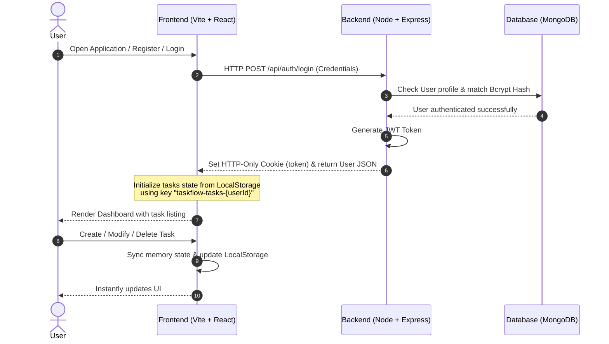

## TaskBro - Task Manager

TaskBro is a modern, responsive, and secure task management web application built with a React-Vite frontend, Express/Node.js backend, and MongoDB database. It features secure JWT-based HTTP-Only Cookie authentication and integrates a client-side state manager that persists tasks locally per-user.

This document serves as the complete technical specification, setup guide, and architectural layout for the TaskBro application.


### 🗺️ System Architecture

TaskBro is built using a decoupled client-server architecture. Below is a conceptual view of how components interact:



### 🚀 Key Features

- **🔐 High-Security Authentication**: Secure user registration and login utilizing JWT tokens passed via secure HTTP-Only Cookies to prevent XSS (Cross-Site Scripting) and CSRF (Cross-Site Request Forgery) vulnerabilities.
- **💼 Per-User Task Isolation**: Encrypted database users coupled with client-side isolation ensuring tasks are mapped strictly to the logged-in user via unique identifiers (`taskflow-tasks-${userId}`).
- **📊 Real-time Dashboard Analytics**: Instant metrics visualization on completed, pending, and total tasks, including an interactive completion rate gauge and priority breakdown chart.
- **🏷️ Task Priority System**: Three-tier priority labeling (Low / Medium / High) on all tasks, with color-coded badges for quick visual identification.
- **🔍 Advanced Filtering**: Filter tasks by completion status (All / Pending / Completed) and priority level (All / Low / Medium / High) from the dedicated Tasks page.
- **🔎 Instant Fuzzy Search**: Real-time searching of tasks based on titles and descriptions.
- **📅 Deadline Tracking**: Add optional due dates to track task completion schedules.
- **🛡️ Secure Password Management**: Built-in functionality for users to change their password securely using bcrypt hashing.
- **📱 Fluid UI/UX**: Crafted using React, styled with Tailwind CSS, and optimized with Vite for ultra-fast performance.
- **🔔 Toast Notifications**: Global animated top-center toast system for success and error feedback across login, register, change-password, and task actions — no browser alerts.
- **🗑️ Delete Task Modal**: Inline styled modal matching the app's design language (consistent with AddTaskModal) used to confirm task deletion.
- **📈 TaskChart**: SVG-based radial gauge for completion rate and a horizontal stacked bar chart for priority distribution.


### 🛠️ Technology Stack

| Layer | Technology | Version | Description |
| :--- | :--- | :--- | :--- |
| **Frontend Core** | React | `^19.2.0` | Declarative UI components & state management |
| **Client Routing** | React Router DOM | `^7.15.1` | Handle application navigation paths client-side |
| **Build Tooling** | Vite | `^7.2.4` | Superfast HMR development server and optimized bundler |
| **Styling** | Tailwind CSS | `^3.4.19` | Utility-first styling framework for responsive web design |
| **HTTP Client** | Axios | `^1.17.0` | Promise-based HTTP client for API communication |
| **ID Generation** | UUID | `^13.0.0` | RFC-compliant unique identifier generation for client-side tasks |
| **Backend Core** | Node.js / Express | `^4.21.2` | Minimalist web framework for routing and middleware orchestration |
| **Database ORM** | Mongoose | `^8.12.0` | Object data modeling for MongoDB schema definition |
| **Session Security** | JWT / Cookies | `^9.0.2` / `^1.4.6` | Session management via sign verification |
| **Password Security** | BcryptJS | `^3.0.2` | Hashing function for securing stored credentials |


### 📁 Directory Structure

```text
TaskBro/
├── Backend/
│   ├── src/
│   │   ├── config/
│   │   │   └── db.config.js       # MongoDB connection database wrapper
│   │   ├── controllers/
│   │   │   └── auth.controller.js # Auth operations (login, register, logout, getMe, changePassword)
│   │   ├── middleware/
│   │   │   └── auth.middleware.js # Protect routes, check token, and attach user to req
│   │   ├── models/
│   │   │   └── user.model.js      # User validation and mongoose schema model
│   │   └── routes/
│   │       └── auth.routes.js     # API Route boundaries mapping middleware and controller
│   ├── .env                       # Backend local configuration & secrets
│   ├── .env.example               # Backend template configuration
│   ├── server.js                  # Main entrypoint initializing express, middleware, routes
│   ├── package-lock.json
│   └── package.json               # Backend node package manifest
│
├── Frontend/
│   ├── public/                    # Raw static public assets
│   ├── src/
│   │   ├── assets/                # App-compiled asset structures
│   │   ├── components/
│   │   │   ├── AddTaskModal.jsx   # Modal form to capture task fields (title, description, priority, due date)
│   │   │   ├── DeleteTaskModal.jsx # Confirmation modal for task deletion
│   │   │   ├── Footer.jsx         # Application footer component
│   │   │   ├── SearchBar.jsx      # Fuzzy text task filter input
│   │   │   ├── TaskCard.jsx       # Layout component for individual tasks
│   │   │   ├── TaskChart.jsx      # SVG radial gauge & priority stacked bar chart
│   │   │   ├── TaskList.jsx       # Grid wrapper rendering multiple TaskCards
│   │   │   ├── TaskStats.jsx      # Dashboard statistics analytics banner
│   │   │   └── Toast.jsx          # Animated top-center toast notification UI
│   │   ├── contexts/
│   │   │   └── ToastContext.jsx   # Global toast state provider & useToast() hook
│   │   ├── pages/
│   │   │   ├── ChangePassword.jsx # Form view to execute password update
│   │   │   ├── Dashboard.jsx      # Main layout displaying welcome, stats, charts & recent tasks
│   │   │   ├── Header.jsx         # App navigation and logout trigger
│   │   │   ├── Login.jsx          # Secure login portal page
│   │   │   ├── Register.jsx       # Secure user registration portal
│   │   │   └── TasksPage.jsx      # Full task management page with search, status & priority filters
│   │   ├── services/
│   │   │   └── api.js             # Centralized Axios API configuration and auth requests
│   │   ├── App.css                # Root component animations & resets
│   │   ├── App.jsx                # Router config, global state, task state lifecycles
│   │   ├── index.css              # Entrypoint styling loading Tailwind directives
│   │   └── main.jsx               # ReactDOM container mounting index
│   ├── .env                       # Frontend local configuration
│   ├── .env.example               # Frontend template local configuration
│   ├── eslint.config.js           # Linter configuration guidelines
│   ├── postcss.config.js          # Tailwind preprocessor config
│   ├── tailwind.config.js         # Tailwind styling constraints and custom themes
│   ├── vite.config.js             # Vite development environment variables
│   ├── package-lock.json
│   └── package.json               # Frontend package dependencies list
```


### 🔧 Installation & Setup

#### Prerequisites
Before installing, ensure you have the following CLI utilities installed globally on your machine:
* **NodeJS**: `node -v` (Should yield `>= v18.0.0`)
* **NPM**: `npm -v` (Should yield `>= v9.0.0`)
* **MongoDB**: A running MongoDB instance locally or a connection string to MongoDB Atlas.


#### Step 1: Set up the Backend

1. Navigate to the backend directory:
   ```bash
   cd Backend
   ```
2. Install dependencies:
   ```bash
   npm install
   ```
3. Create a `.env` file in the root of the `Backend/` directory and configure the environment variables:
   ```env
   PORT=5000
   NODE_ENV=development
   MONGO_URI=your_mongodb_connection_string
   JWT_SECRET=your_jwt_strong_secret_key
   JWT_EXPIRES_IN=7d
   CLIENT_URL=http://localhost:5173
   ```

   **Environment Variable Parameter Matrix:**

   | Key | Default | Description | Requirement |
   | :--- | :--- | :--- | :--- |
   | `PORT` | `5000` | Port Express backend binds to listen for API requests | Optional (Defaults to 5000) |
   | `NODE_ENV` | `development` | Environment mode flag (`development`, `production`). Adjusts cookie secure tags and stack trace visibility | Required |
   | `MONGO_URI` | *None* | Connection URL for MongoDB Database Instance | Required |
   | `JWT_SECRET` | *None* | Strong secret string used to sign and verify JSON Web Tokens | Required |
   | `JWT_EXPIRES_IN` | `7d` | Lifespan duration configuration string for issued JWTs | Required |
   | `CLIENT_URL` | `http://localhost:5173` | Allowed frontend URL for CORS access control | Required |

4. Start the backend development server:
   ```bash
   npm run dev
   ```
   *The server will start on port `5000` (or the configured `PORT`).*


#### Step 2: Set up the Frontend

1. Navigate to the frontend directory:
   ```bash
   cd ../Frontend
   ```
2. Install dependencies:
   ```bash
   npm install
   ```
3. Create a `.env` file in the root of the `Frontend/` directory and configure the environment variables:
   ```env
   VITE_API_URL=http://localhost:5000
   ```
4. Start the Vite development server:
   ```bash
   npm run dev
   ```
   *By default, the frontend will be running on `http://localhost:5173`.*


### 🔌 API Documentation

All API requests must go to the backend host (default: `http://localhost:5000`). Make sure to enable credentials support on your HTTP Client (`credentials: 'include'`) for httpOnly session validation.

#### Authentication Endpoints (`/api/auth`)

#### 1. Register User
* **Method**: `POST`
* **Path**: `/api/auth/register`
* **Headers**: `Content-Type: application/json`
* **Request Body**:
  ```json
  {
    "username": "johndoe",
    "email": "johndoe@example.com",
    "password": "securepassword123"
  }
  ```
* **Success Response (201 Created)**:
  ```json
  {
    "success": true,
    "message": "User registered successfully",
    "userId": "647209e86cfc7a001a1db902",
    "user": {
      "_id": "647209e86cfc7a001a1db902",
      "username": "johndoe",
      "email": "johndoe@example.com"
    },
    "token": "eyJhbGciOiJIUzI1NiIsInR5cCI6IkpXVCJ9..."
  }
  ```
* **Failure Response (400 Bad Request)**:
  ```json
  {
    "message": "User already exists with this email"
  }
  ```


#### 2. User Login
* **Method**: `POST`
* **Path**: `/api/auth/login`
* **Headers**: `Content-Type: application/json`
* **Request Body**:
  ```json
  {
    "email": "johndoe@example.com",
    "password": "securepassword123"
  }
  ```
* **Success Response (200 OK)**:
  *Sets HTTP-Only cookie `token`*
  ```json
  {
    "success": true,
    "user": {
      "_id": "647209e86cfc7a001a1db902",
      "username": "johndoe",
      "email": "johndoe@example.com"
    },
    "token": "eyJhbGciOiJIUzI1NiIsInR5cCI6IkpXVCJ9..."
  }
  ```
* **Failure Response (401 Unauthorized)**:
  ```json
  {
    "message": "Invalid email or password"
  }
  ```


#### 3. User Logout
* **Method**: `POST`
* **Path**: `/api/auth/logout`
* **Credentials**: Required
* **Success Response (200 OK)**:
  *Clears HTTP-Only cookie `token`*
  ```json
  {
    "success": true,
    "message": "Logged out successfully"
  }
  ```


#### 4. Get Current Profile
* **Method**: `GET`
* **Path**: `/api/auth/me`
* **Credentials**: Required
* **Success Response (200 OK)**:
  ```json
  {
    "success": true,
    "user": {
      "_id": "647209e86cfc7a001a1db902",
      "username": "johndoe",
      "email": "johndoe@example.com",
      "createdAt": "2026-06-11T06:02:30.000Z",
      "updatedAt": "2026-06-11T06:02:30.000Z"
    }
  }
  ```
* **Failure Response (401 Unauthorized)**:
  ```json
  {
    "message": "Not authorized, token failed"
  }
  ```


#### 5. Change Password
* **Method**: `PUT`
* **Path**: `/api/auth/change-password`
* **Credentials**: Required
* **Request Body**:
  ```json
  {
    "currentPassword": "securepassword123",
    "newPassword": "newsecurepassword456"
  }
  ```
* **Success Response (200 OK)**:
  ```json
  {
    "success": true,
    "message": "Password changed successfully"
  }
  ```
* **Failure Response (400 Bad Request)**:
  ```json
  {
    "message": "Incorrect current password"
  }
  ```


### 🛡️ Security Architecture

TaskBro is engineered with secure-by-default architecture parameters:

1. **Cookie-Based Token Distribution (HTTP-Only)**:
   Tokens generated at login/signup are distributed via server-write cookie options:
   ```javascript
   res.cookie('token', token, {
     httpOnly: true,  // Disallows access from client-side Document.cookie API (Neutralizes XSS)
     secure: process.env.NODE_ENV === 'production', // Disallows transmitting token over unencrypted HTTP (True in prod)
     sameSite: 'Lax',  // Mitigates CSRF requests while allowing standard cross-site redirection navigation
     maxAge: 7 * 24 * 60 * 60 * 1000, // Explicit token expiry tracking matching token signature (7 Days)
   });
   ```

2. **Credentials Protection (Bcrypt Hash Engine)**:
   Passwords are never stored in plaintext format. When a new user registers or updates a password:
   * A cryptographic salt factor of `10` is generated.
   * The plaintext password is encrypted using the salt, making decryption extremely resource-heavy.
   * User authentication works by running cryptographic comparison `bcrypt.compare(plaintext, hashed)` on the MongoDB data structure.

3. **Restricted Cross-Origin Resource Sharing (CORS)**:
   Cross-site scripting attacks are countered on the router container level:
   ```javascript
   const allowedOrigins = [
     'http://localhost:5173',
     'http://127.0.0.1:5173'
   ];
   if (process.env.CLIENT_URL) {
     allowedOrigins.push(process.env.CLIENT_URL);
   }

   app.use(cors({
     origin: allowedOrigins,
     credentials: true,
   }));
   ```


### 🖥️ Client-side Architecture

The frontend orchestrates tasks on the client-side to maximize application speed and minimize unnecessary server loads.

#### Application Routes

| Path | Component | Description |
| :--- | :--- | :--- |
| `/login` | `Login.jsx` | Secure login portal (redirects to `/` if already authenticated) |
| `/signup` | `Register.jsx` | New user registration (redirects to `/` if already authenticated) |
| `/` | `Dashboard.jsx` | Welcome banner, stats cards, TaskChart analytics, and recent tasks |
| `/tasks` | `TasksPage.jsx` | Full task list with search, status filter, and priority filter |
| `/change-password` | `ChangePassword.jsx` | Secure password update form |

#### LocalStorage Partitioning Lifecycle:
Instead of mixing global state, TaskBro divides tasks on a user-by-user basis using client-side partitioning key schemas:
1. When user login state resolves:
   * The app extracts user property `_id`.
   * Sets storage target pointer key: `taskflow-tasks-${userId}`.
2. In-memory state `tasks` loads from corresponding key partition.
3. Every task state update (Add, Delete, Edit, Toggle) triggers a reactive state flush to the respective key.
4. When a user logs out:
   * In-memory task state is instantly reset to `[]`.
   * Current user cache is deleted.
   * Other user data in `localStorage` remains untouched and completely isolated.

#### Task Data Schema (Client representation):
```json
{
  "id": "2d7b2752-6cb0-466d-8848-936b8017c6a9",
  "title": "Deploy Backend API to production server",
  "description": "Ensure environmental secret credentials and CORS origins are configured before launch.",
  "priority": "high",
  "dueDate": "2026-06-18",
  "completed": false,
  "createdAt": "2026-06-11T11:42:38.283Z"
}
```

**Priority field values**: `"low"` | `"medium"` *(default)* | `"high"`


### 🔧 Troubleshooting & Common Issues

#### 1. CORS Blocked Request Exception
* **Symptom**: Console outputs error matching `Access to fetch at 'http://localhost:5000/api/auth/me' from origin 'http://localhost:port' has been blocked by CORS policy`.
* **Fix**: Ensure your React application is running precisely on `http://localhost:5173`. If you are using a different port or in production, add it to your `FRONTEND_URL` environment variable inside your backend's `.env` configuration file:
  ```env
  CLIENT_URL=http://localhost:NEW_PORT
  ```

#### 2. MongoDB Connection Failure
* **Symptom**: Server crashes on startup with `MongooseServerSelectionError: connection timed out`.
* **Fix**:
  * Ensure MongoDB server is active if running locally.
  * If using MongoDB Atlas, check that you have added your current IP address to the Network Access whitelist inside the MongoDB Atlas Console.

#### 3. Cookies Not Sending with Requests
* **Symptom**: User logs in successfully, but subsequent requests to `/api/auth/me` return `401 Unauthorized` (no token provided).
* **Fix**: Confirm that your API fetch calls in the React source code include the option `credentials: 'include'`. Standard fetches do not attach cookies cross-origin by default without this flag.


### 🤝 Contributing

Contributions are what make the open source community such an amazing place to learn, inspire, and create. Any contributions you make are **greatly appreciated**.

1. Fork the Project
2. Create your Feature Branch (`git checkout -b feature/AmazingFeature`)
3. Commit your Changes (`git commit -m 'Add some AmazingFeature'`)
4. Push to the Branch (`git push origin feature/AmazingFeature`)
5. Open a Pull Request


### 📄 License

Distributed under the MIT License. See `LICENSE` for more information.
